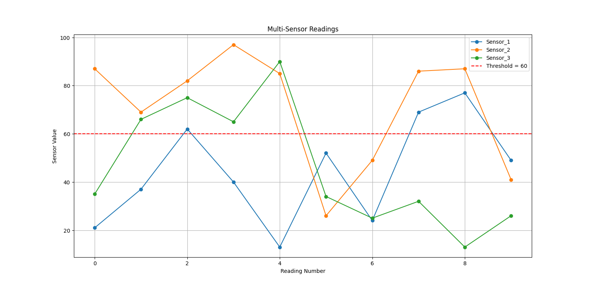

# Multi-Sensor Fault Monitoring System using Python

## Project Overview
This is a Python project that simulates multiple sensor readings, detects faults based on a threshold, calculates statistics like fault percentage and average, stores the data in a CSV file, and visualizes the results using graphs.  

The project demonstrates a full data pipeline: **Data Generation → Analysis → Storage → Visualization**.

---

## Features
- Simulates readings from multiple sensors
- Detects faults when values cross a specified threshold
- Calculates statistics:
  - Fault count
  - Fault percentage
  - Average sensor reading
- Saves all sensor data in a CSV file (`multi_sensor_data.csv`)
- Visualizes sensor readings in a multi-line graph
- Highlights threshold value in the graph for easy identification
- Supports multiple sensors in a single run

---

## Technologies Used
- Python
- Random module (for simulated sensor data)
- CSV module (for storing data)
- Matplotlib (for plotting graphs)

---

## How to Run
1. Clone or download this repository.
2. Open `main.py` in any Python IDE (VS Code recommended).
3. Run the script:
   ```bash
   python main.py
   Enter a threshold value when prompted.
Outputs:
Terminal: Displays sensor readings, fault count, fault percentage, and average.
CSV File: multi_sensor_data.csv with all sensor readings.
Graph: Multi-sensor readings plotted with threshold line.
### project output 
